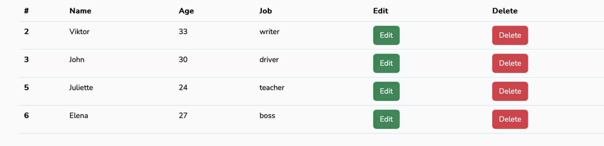

# About

Using Laravel, VueJS and MySQL, I created a page where the ability to add, change, and delete data from the DB is implemented. In this particular work, inheritance between components and seamless interaction with the DB are worked out. 

Используя Laravel, VueJS and MySQL, создал страницу где реализованы возможность добавлять, изменять, удалять данные из БД. В конкретно данной работе проработаны наследование между компонентами, бесшовное взаимодействие с БД.

## First steps

Let's watch how to start application development, based on this template. 

We need to get the sources:

```shell
$ git https://github.com/AlexanderBeli/Laravel_VueJS_MySQL.git
$ cd ./Laravel_VueJS_MySQL
```
Then we need to launch it:

```shell
$ composer install
$ npm run build
$ php artisan serve
```

Open the browser and open the localhost:

```shell
http://localhost:8080/
```
## Tools

Laravel 11, Vue, Vuex

## License

The Laravel framework is open-sourced software licensed under the [MIT license](https://opensource.org/licenses/MIT).
